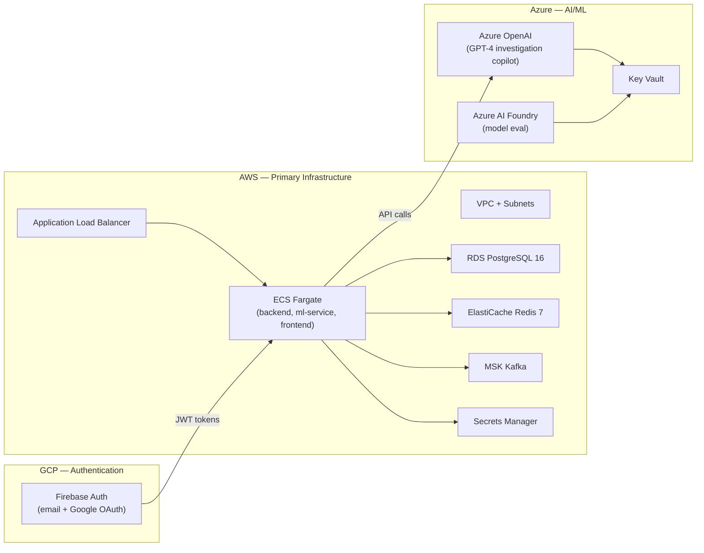

# Terraform Multi-Cloud Infrastructure

Terraform modules for provisioning the Fraud Prevention Platform across three cloud providers, each serving a specific purpose:



## Architecture

| Cloud | Role | Services |
|-------|------|----------|
| **AWS** | Primary infrastructure | VPC, ECS Fargate, RDS PostgreSQL, ElastiCache Redis, MSK Kafka, Secrets Manager, ALB |
| **GCP** | Frontend authentication | Firebase Auth (email/password + Google OAuth) |
| **Azure** | AI/ML services | Azure OpenAI (GPT-4), AI Foundry, Key Vault |

## Directory Structure

```
infrastructure/terraform/
├── versions.tf                    # Provider versions + config
├── variables.tf                   # Root variables
├── .gitignore
├── modules/
│   ├── aws/
│   │   ├── networking/            # VPC, subnets, security groups
│   │   ├── compute/               # ECS Fargate, ALB, auto-scaling
│   │   ├── database/              # RDS PostgreSQL 16
│   │   ├── cache/                 # ElastiCache Redis 7
│   │   ├── messaging/             # MSK Kafka (7 topics)
│   │   └── secrets/               # Secrets Manager
│   ├── gcp/
│   │   └── firebase-auth/         # Firebase project + auth config
│   └── azure/
│       └── ai-ml/                 # Azure OpenAI + Foundry + Key Vault
└── environments/
    ├── dev/                       # Single-AZ, small instances
    ├── staging/                   # Multi-AZ, medium instances
    └── prod/                      # Multi-AZ, large instances, HA
```

## Quickstart

```bash
# 1. Install Terraform >= 1.5
brew install terraform

# 2. Navigate to environment
cd infrastructure/terraform/environments/dev

# 3. Initialize
terraform init

# 4. Plan
terraform plan -var-file=terraform.tfvars

# 5. Apply
terraform apply -var-file=terraform.tfvars
```

## Environment Sizing

| Resource | Dev | Staging | Prod |
|----------|-----|---------|------|
| **ECS tasks** | 1–3 | 2–5 | 3–10 |
| **RDS** | db.t4g.micro (single-AZ) | db.t4g.medium (multi-AZ) | db.r6g.large (multi-AZ) |
| **Redis** | cache.t4g.micro (1 node) | cache.t4g.medium (2 nodes) | cache.r6g.large (3 nodes) |
| **MSK** | kafka.t3.small (1 broker) | kafka.m5.large (2 brokers) | kafka.m5.xlarge (3 brokers) |
| **Backups** | 1 day | 7 days | 30 days |
| **GPT-4 capacity** | 1 | 5 | 20 |

## Cost Estimation

Approximate monthly costs (us-east-1, on-demand):

| Environment | AWS | GCP | Azure | Total |
|-------------|-----|-----|-------|-------|
| **Dev** | ~$80/mo | Free tier | ~$15/mo | ~$95/mo |
| **Staging** | ~$250/mo | Free tier | ~$50/mo | ~$300/mo |
| **Prod** | ~$800/mo | ~$25/mo | ~$200/mo | ~$1,025/mo |

Use `infracost` for precise estimates:
```bash
brew install infracost
infracost breakdown --path infrastructure/terraform/environments/dev
```

## Remote State

State is stored in S3 with DynamoDB locking:

| Environment | S3 Key | DynamoDB Table |
|-------------|--------|----------------|
| dev | `dev/terraform.tfstate` | `fraud-prevention-terraform-locks` |
| staging | `staging/terraform.tfstate` | `fraud-prevention-terraform-locks` |
| prod | `prod/terraform.tfstate` | `fraud-prevention-terraform-locks` |

## CI/CD

GitHub Actions workflow (`.github/workflows/terraform.yml`):

- **PR → Plan**: Runs `terraform plan` for all environments, posts output as PR comment
- **Merge to main → Apply**: Auto-applies to `dev`; `staging` and `prod` require manual approval via GitHub environment protection rules
- **OIDC authentication**: No long-lived credentials stored in GitHub secrets

### Required GitHub Secrets

| Secret | Description |
|--------|-------------|
| `AWS_ROLE_ARN` | IAM role ARN for OIDC federation |
| `GCP_WORKLOAD_IDENTITY_PROVIDER` | GCP Workload Identity provider |
| `GCP_SERVICE_ACCOUNT` | GCP service account email |
| `AZURE_CLIENT_ID` | Azure app registration client ID |
| `AZURE_TENANT_ID` | Azure AD tenant ID |
| `AZURE_SUBSCRIPTION_ID` | Azure subscription ID |

## Module Reference

### AWS Modules

| Module | Inputs | Outputs |
|--------|--------|---------|
| `networking` | `environment`, `project_name`, `vpc_cidr`, `azs` | `vpc_id`, `public_subnet_ids`, `private_subnet_ids`, `*_security_group_id` |
| `compute` | `vpc_id`, `*_subnet_ids`, `*_security_group_id`, `rds_endpoint`, `redis_endpoint`, `kafka_brokers` | `alb_dns_name`, `ecs_cluster_arn`, `*_service_arn` |
| `database` | `private_subnet_ids`, `data_security_group_id`, `multi_az`, `instance_class` | `rds_endpoint`, `rds_port`, `db_password` |
| `cache` | `private_subnet_ids`, `data_security_group_id`, `node_type`, `num_cache_nodes` | `redis_endpoint`, `redis_port` |
| `messaging` | `private_subnet_ids`, `messaging_security_group_id`, `number_of_broker_nodes` | `bootstrap_brokers`, `cluster_arn` |
| `secrets` | `db_password`, `jwt_secret`, `anthropic_api_key` | `secret_arns`, `secret_names` |

### GCP Modules

| Module | Inputs | Outputs |
|--------|--------|---------|
| `firebase-auth` | `gcp_project_id`, `google_oauth_client_id`, `google_oauth_client_secret` | `firebase_config`, `firebase_project_id`, `service_account_email` |

### Azure Modules

| Module | Inputs | Outputs |
|--------|--------|---------|
| `ai-ml` | `resource_group_name`, `location`, `gpt4_capacity` | `openai_endpoint`, `openai_deployment_name`, `foundry_workspace_id`, `keyvault_uri` |

## Troubleshooting

| Issue | Fix |
|-------|-----|
| `Error: no matching VPC found` | Run `terraform init` to refresh provider |
| `Error: state lock` | Check DynamoDB for stale locks: `aws dynamodb scan --table-name fraud-prevention-terraform-locks` |
| `Error: unauthorized` | Re-authenticate: `aws sso login` / `gcloud auth login` / `az login` |
| `Error: quota exceeded` | Request quota increase in AWS/GCP/Azure console |
